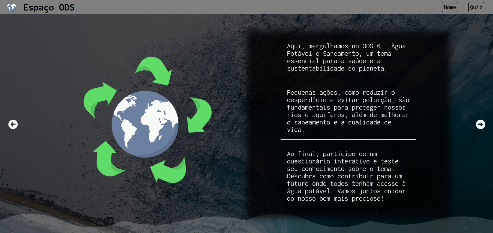
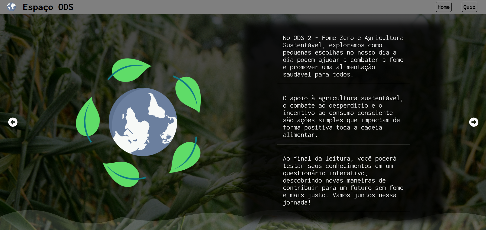
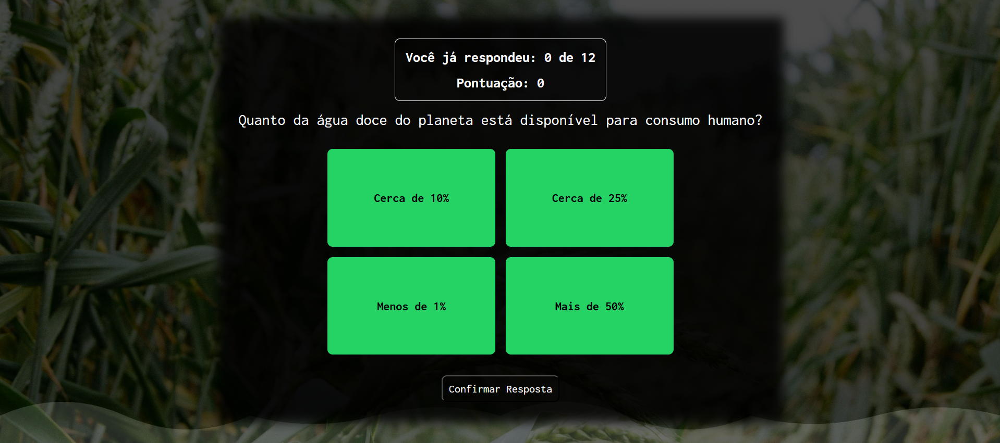
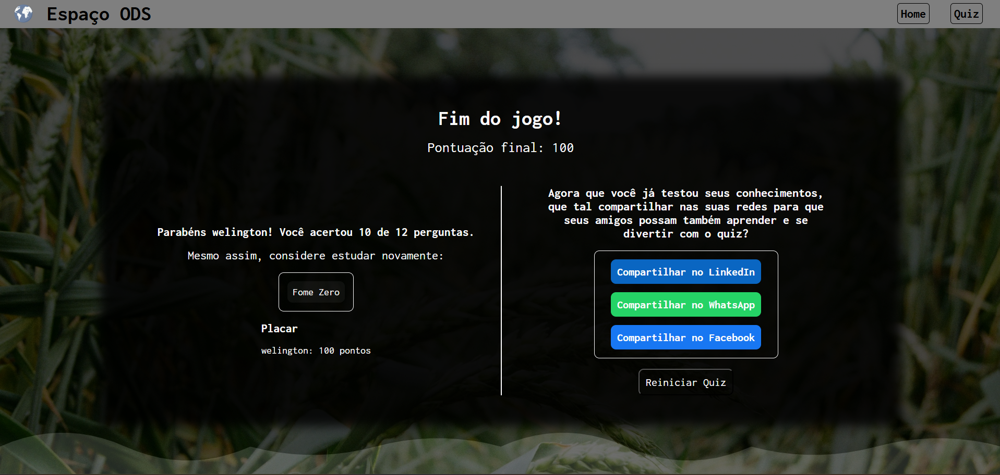

# Espaço ODS

O **Espaço ODS** é um site desenvolvido especialmente para o desafio Hackathon organizado pela CPDI. O objetivo era criar um site informativo sobre um dos Objetivos de Desenvolvimento Sustentável (ODS) de sua escolha. O projeto inclui um **quiz interativo** no final, onde os usuários podem testar seus conhecimentos. A navegação foi implementada de forma simples como uma **SPA (Single Page Application)** utilizando rotas do React.

 

## ✨ Funcionalidades

- **Educar sobre ODS**: Apresenta informações detalhadas sobre os Objetivos de Desenvolvimento Sustentável.
- **Testar conhecimentos**: Inclui um quiz interativo para avaliar o aprendizado do usuário.
- **Compartilhar com amigos**: Possibilidade de compartilhar o site com amigos por meio de um link direto.

 

## 🛠️ Tecnologias Utilizadas

- **React**: Biblioteca para construção de interfaces de usuário.

- **React Router DOM**: Para gerenciar as rotas e navegação SPA.

- **Context API**: Para gerenciamento de estado global.

- **Vite**: Ferramenta de build e desenvolvimento rápido.

- **CSS Modules**: Para estilização encapsulada e organizada.

- **JavaScript**: Linguagem principal do desenvolvimento.

 

## 🖼️ Galeria de Imagens

Aqui estão algumas capturas de tela do projeto:

1. **Página Inicial**

    

2. **Seção Informativa sobre ODS**

    

3. **Quiz Interativo** 

    

4. **Compartilhamento do Link** 

    

## 🌐 Acesse o Site ao Vivo

Acesse o projeto diretamente pelo link:  
[https://welington1209.github.io/Hackaton-CPDI-ODS/](https://welington1209.github.io/Hackaton-CPDI-ODS/)

---

### Autor

**Welington da Silva**
